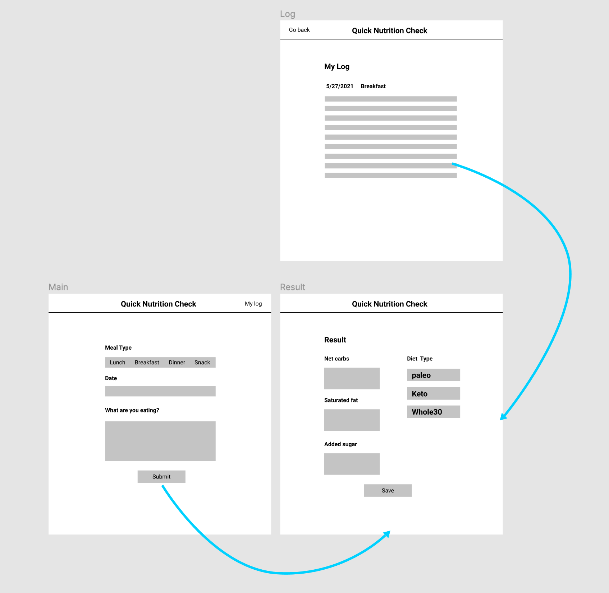

# Project | Quick Nutrition Check 

## About

This app will help users that are interested in quick and simple nutrition calculation and logging. This app will focus on deficient nutritional summery for those who are focusing on low-carb and low-sugar diet. it will assist the users with day to day food logging fatigue. 

## Wireframe

## Dependencies

* React
* React-bootstrap
* Edamam API
* Local storage (nice to have)

## Tasks 

#### Week1
* Setup create-react-app scaffold
* Setup Netlify and Github pipeline 
* Setup and learn react-bootstrap
* Code static HTML and CSS views
* Store and test API results in React component state
* Test local storage

#### Week2
* Code components 
* Test 
* Deploy to Netlify
